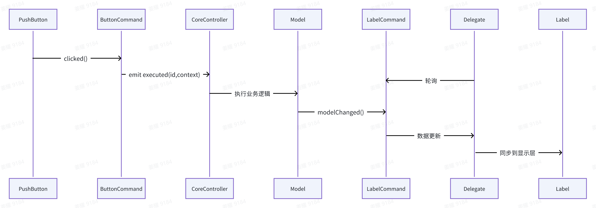

Learning Qt project architecture based on MVC and UI factory mode.

# 1. 总体架构
采用经典的 **MVC 架构**，实现数据、视图、控制三层解耦：  
- **Model**：负责数据与业务状态。  
- **View**：仅做展示，不直接操作 QWidget。  
- **Controller**：接收事件并调度业务逻辑。  

所有可视化控件被抽象为 **Command** 对象：  
- 通过 **桥接 + 工厂模式** 屏蔽底层 QWidget 细节。  
- Command 负责把用户输入翻译成 `signal(commandId, context)` 并发送给 Controller。

# 2. 事件流
第一条线(输入驱动业务）：  
Input → View → Command.execute() → 发出 signal(commandId, context) → Controller 派发 → 执行业务逻辑 → 更新 Model  
第二条线(数据更新驱动视图刷新):  
Model 变化 → Command 拉取数据（信号触发）→ Delegate 轮询Command 状态 → Delegate 同步数据给 View  
第三条线(通过工厂创建UI)：  
View 创建时 → 向 UIFactory 提交 Command 序列 → 工厂决定使用何种 QWidget → 使用桥接构造控件 → 控件与对应 Command 绑定（双向）  

> **图示**

# 3. 模块设计

### 3.1 Command 体系
| 类 | 职责 |
|---|---|
| `AbstractCommand` | 定义 `execute()`、`commandId`、`context`、双向绑定接口 |
| `ButtonCommand` | 扩展：按钮文本、图标、点击反馈 |
| `RadioCommand` | 扩展：互斥分组 `groupName` |
| `MenuCommand` | 扩展：下拉菜单层级，可触发子 `Command` |

### 3.2 Controller 体系
| 类 | 职责 |
|---|---|
| `CoreController` (单例) | 接收 `(commandId, context)` 并路由到具体业务函数 |
| 分发策略 | 简单的 `switch-case`；未来可替换为策略/表驱动 |

### 3.3 Model 体系
| 模型 | 数据内容 |
|---|---|
| `DocumentModel` | PDF 文档句柄、当前页码、缩放比例 |
| `AnnotationModel` | 注释列表（类型、位置、内容） |
| `BookmarkModel` | 书签树结构 |
| `SearchModel` | 关键词、匹配结果、高亮范围 |
| `ConfigModel` | 主题、语言、快捷键等用户偏好 |

### 3.4 Delegate 体系
| 类 | 职责 |
|---|---|
| `AbstractDelegate` | 持有 `Command + QWidget` 引用，定时/事件同步数据 |
| `PdfDelegate` | PDF 视图专用：监听滚动、缩放、注释变化并刷新 |

### 3.5 Factory 体系
| 类 | 职责 |
|---|---|
| `AbstractFactory` | 纯虚接口 `createWidget(Command*)` |
| `ButtonFactory` | 创建 `QPushButton/QToolButton` 并绑定 `ButtonCommand` |
| `MenuFactory` | 创建 `QMenu/QAction` 并绑定 `MenuCommand` |